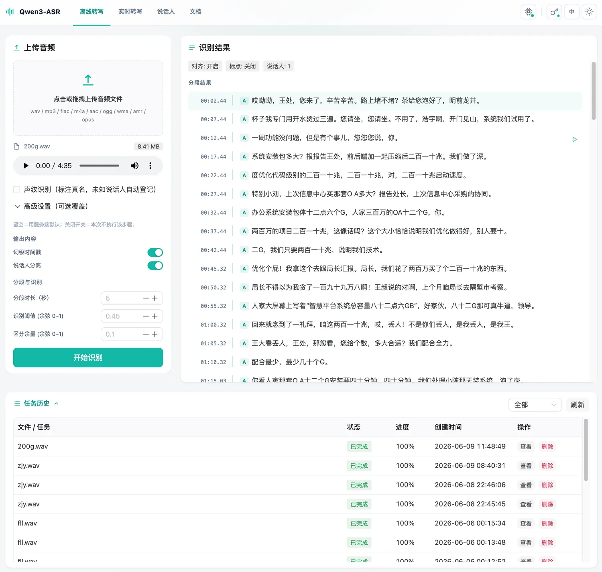
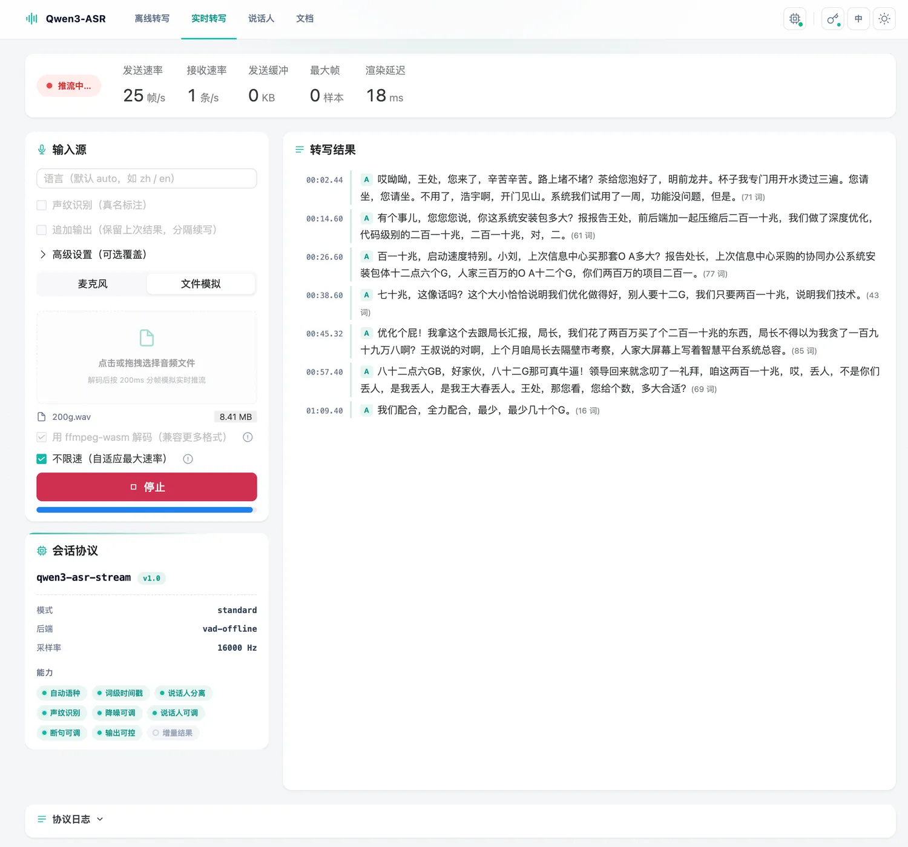

# Qwen3-ASR Service

[中文](README_zh.md) | **English**

A simple, fast and efficient speech recognition API service based on Qwen3-ASR. Out-of-the-box, with offline long-form and real-time streaming transcription in one, speaker diarization / voiceprint identification, and a feature-rich, polished Web UI. Cross-platform on Linux / macOS / Windows with Docker container deployment, and dual-mode inference on GPU (CUDA) and CPU (OpenVINO INT8).

## Features

- ⚡ **Fast startup, fast transcription** - The service starts quickly; long-audio transcription takes far less time than the audio duration — especially on GPU, while CPU mode stays efficient thanks to OpenVINO INT8 quantization
- **Real-time Transcription** - WebSocket streaming endpoint, sentence-by-sentence results for microphone / streamed audio
- **Speaker Diarization** - Offline / real-time transcripts annotated with anonymous speaker labels A/B/C… (CAM++ voiceprint model, CPU inference)
- **Voiceprint Database** - Enrolled speakers show their real names in transcripts; unknown speakers are auto-enrolled with placeholder names, with one-click rename in the Web management page (speakers.db, authentication required)
- **Far-field Filtering / Tunable Params** - Real-time segment-level energy/SNR gating reduces far-field and ambient false triggers; speaker, endpointing and output params can be overridden per request/session
- **OpenAI / DashScope Compatible APIs** - Point your base_url at this service to integrate the OpenAI / Alibaba Cloud DashScope ecosystem (offline + realtime) — no business-code changes
- **Async Tasks + Persistence** - Submit and poll for results; task results queryable across restarts (tasks.db)
- **Web UI** - Modern interface (Vue 3 + Naive UI, dark theme): offline transcription, real-time transcription, speaker management, auto-refreshing task history and offline documentation center
- **Flexible Configuration** - Four priority layers: YAML config file / CLI arguments / environment variables
- **Out-of-the-box** - One-click installation and deployment, automatic model download, config file auto-generated on first startup
- **Long Audio Support** - Audio files from 1s to 4 hours with automatic VAD segmentation
- **Multi-format Support** - WAV / MP3 / FLAC / M4A / AAC / OGG and more
- **Timestamps** - Sentence-level / word-level timestamps (GPU mode)
- **Auto Punctuation** - Integrated CT-Transformer punctuation restoration model
- **API Authentication** - Optional Bearer Token authentication
- **Interactive Management** - CLI management script supporting Docker / venv dual-mode management

## Quick Start

> Requirements: Python 3.10+, ffmpeg; GPU mode needs NVIDIA GPU + CUDA 12.1+ (see the [deployment guide](docs/deployment_EN.md)).

**Recommended**: run the interactive management script at the repo root (unified Docker / venv entry, guided install and start/stop):

```bash
bash manage.sh          # Linux / macOS; on Windows run .\manage.ps1 in PowerShell
```

> Or do it manually, step by step (in the app directory):
> ```bash
> cd asr-service
> bash setup.sh        # Initialize the environment
> bash start.sh        # Start the service (auto-detects device, downloads models, generates config.yaml)
> ```

```bash
# Verify
curl http://127.0.0.1:8765/v2/health
```

> ⚠️ **Upgrading from v1**: if you already have a v1 virtual environment, v2 adds new dependencies (speaker diarization, voiceprint database, documentation center, etc.) — update them before starting. Re-run `bash setup.sh` and answer `N` when asked to recreate the venv to keep your existing one; the script still installs/updates the new dependencies from `requirements.txt`.

Open `http://127.0.0.1:8765/web-ui` in a browser to try it out (Web UI, real-time transcription and task persistence are enabled by default in the auto-generated config).

With Docker:

```bash
docker run -d --gpus all -p 8765:8765 \
  -v ./asr-service/models:/app/models \
  --name qwen3-asr-service \
  lancelrq/qwen3-asr-service:latest --web
```

> Windows deployment, CPU/ARM64 modes, docker-compose, LAN access, API authentication and more: see the [deployment guide](docs/deployment_EN.md).

## Preview

| Offline Transcription | Real-time Transcription |
| :---: | :---: |
|  |  |

## Documentation

| Document | Contents |
|----------|----------|
| [Deployment Guide](docs/deployment_EN.md) | System requirements, Linux / Windows / Docker deployment, operation modes, Web UI, graceful shutdown |
| [Configuration Reference](docs/configuration_EN.md) | Full startup-parameter table, config.yaml, environment variables, task persistence, built-in constants |
| [API Reference v2 (default)](docs/api/v2_EN.md) | Offline batch processing, health / capabilities, real-time WebSocket protocol |
| [API Reference v1 (legacy)](docs/api/v1_EN.md) | Legacy-client compatibility notes and versioning conventions |
| [Compatibility APIs](docs/api/compat_EN.md) | OpenAI / Alibaba Cloud DashScope drop-in compatibility (offline + realtime), just change base_url |
| [Architecture](docs/architecture_EN.md) | Project structure, processing pipeline, key design decisions |
| [Development Guide](docs/development_EN.md) | Dev environment, testing, E2E smoke, single-schema / docs / compat-layer conventions |

---

If you find this project helpful, please consider giving a ⭐ on [GitHub](https://github.com/LanceLRQ/qwen3-asr-service) and [Docker Hub](https://hub.docker.com/r/lancelrq/qwen3-asr-service) — it really helps!
